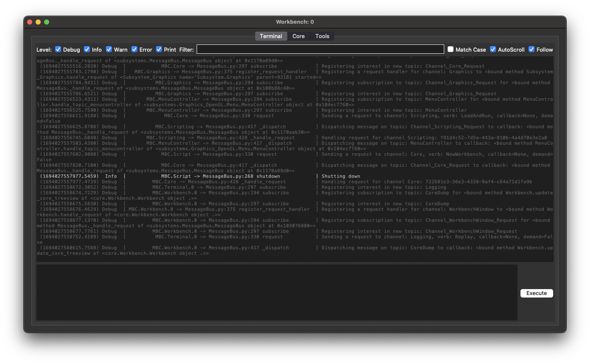

# .plan
Like a blog, but with less effort

## December 19th, 2023

I recently picked superbird (Spotify Car Thing) off the backburner, and spent a bunch of time poking at the framebuffer controls and X11. 
And it turns out, if you twiddle the right knobs, and whisper the right encantation, and use the latest unstable version of everything, then X11 will totally just work fine with the superbird framebuffer display.
I wasted a bunch of time fiddling with the scaling settings before, completely by accident, I ran an example `fbset` command and saw the display... just... work. It took me another hour to sort out why it had worked
and after that I suddenly had a totally viable device! Touch input fell into place pretty quickly after that, this time because the defaults actually worked when my own experiments didn't get in the way. Sigh.
Later on, when I tried to rotate things, I figured out I had touch input config completely wrong, but eventually got it right and got touch input transformed for landscape mode.

With a working display and touch input, the next step was obvious: get a browser going and throw up a Home Assistant dashboard! And thats what I did.

The data partition on the device is only about 2.3GB, but that was just enough for a minimal rootfs with X11 and chromium.

There is certainly a lot more to do here. The buttons and knob are picked up by X11 automatically, but I haven't done anything with those inputs yet.
I would like to use the buttons to trigger scenes and the knob to control the overall lighting level, but I haven't decided yet how I want to do that.

What I have so far is good enough for Home Assistant Kiosk, so I put up what I have so far here: [superbird-debian-kiosk](https://github.com/bishopdynamics/superbird-debian-kiosk)

I already put together a bunch of wall kiosks and set them up throughout the house, hopefully that will motivate me to figure out more interesting things to do with them.

## September 29th, 2023

I've always been really interested in how game engines work, and recently I decided to dive a little deeper by building one myself!
Naturally, I am a hobbyist, not an engineer at a major studio, so I made a lot of choices just because I thought it would be fun to write.

I went with python because I enjoy working in it, and I wasn't particularly concerned about performance. Since I'm a lot more interested in what goes on under the hood, I actually built the graphics system last, and still haven't done anything for audio. 

I started with a Core, which provides a message bus, and manages lifecycle of Services, which provide everything else. Actually, thats a lie. Like most of my projects, I started out by designing yet-another perfect logging system. In this case I pictured a separate Workbench window, with one tab being a live log. The Core and Services could log messages, which would be published on the message bus. And thats pretty much what I built initially. Once I had that going, it was like: great, so... what are we logging? A solution in search of a problem.

So i came up with this convoluted concept of a "Subsystem" originally, and it got pretty ugly. I later rewrote that whole concept into what I now call a Service, mostly because the two coexisted for a while. I learned a lot of wrong ways to do things with this one, for sure.

Speaking of which, one mistake I made early on was implementing my own "message bus" concept using python Queues. I actually had this working pretty well, and pretty quickly, however that turned out to be dumb luck in that I hadn't encountered any of the many lurking race conditions. But before I figured that out, I started benchmarking and found that a round trip message (send message to another process, which sends it back) was taking betwen 5 and 10 milliseconds! Just in case that sounds pretty decent, remember that if you want to render frames at 60 frames per second, you only have 16.666 milliseconds to do things (or at least the things that happen each frame). So if my graphics system wanted to send or receive any messages within the frame loop, well... that was gonna be a bad time. Of course this is worst-case scenario, and most messaging would be done asynchronously. This was just an excuse to say "We need more speed!"

I decided to replace my homegrown message bus with a more battle-tested solution, and I found that ZMQ fit the bill and, more importantly, had enough documentation and examples that I could figure out how to actually use it. I went down many different roads during this time, and looked at many solutions that had very poor documentation. I'm sure there's still a much better solution out there, but this one got it done well enough.

So at first I tried to just shoehorn ZMQ into my existing message bus, but I thats when I realized I had pretty much just ignored all the problems associated with multithreading. Also, my original message bus was tiered, with all nodes being a child of another, and having children themselves. This was silly in hindsight because it meant that some messages had to hop through several nodes to reach a subscriber, adding a delay with each hop. There were several more things very fundamentally wrong with it, and I continue to be surprised it worked at all. I now know a lot more about how not to write a message bus.

So I wrote a clean new system, with carefully placed locks, and then refactored everything else to fit in the new model. Now the round-trip is under 2 milliseconds! Not going to be doing a *lot* of messaging during the render loop, but at least its doable now, and thats a win.

At this point, I had a basic window (good old Tk), with a bunch of stuff logging thanks to some fake services I stubbed out. Check out the filtering. Since logging messages are objects (not just a string) they contain a bunch of metadata fields, and I did some basic `key:value` filtering. That was fun to implement, but I'm looking forward to re-using that code and never having to rewrite it again.

You may notice the log messages reference a bunch of stuff I have not talked about yet, I just felt it was time for a screenshot.

Scripting. This turned out to be the most interesting part to me, and I really really love how it turned out. So there is a project called Restricted Python, which helps you create restricted python environment to run third-party code inside. I mean, it was basically perfect out of the box! I actually loosened a lot of the restrictions, because I'm not using this as a sandbox. In that Workbench terminal above, the input field uses the scripting language, which is just python with a few special considerations! There is a global object `Engine` through which scripts can interact with engine resources, primarily the message bus. When the engine starts up, it starts all the services, and the last thing it does is execute the script named `Default.py`.

I also wrote a Config system, which is pretty much just my imagining of how to implement Quake's CVAR system. I liked the idea of having attributes and restrictions, so in my version its possible to restrict read and/or write access to a specific service and/or function name! You can also set a config var to be read-only globally, and control if should be persisted to file. Is this totally necessary? No! Was it fun to write and test? Heck yeah! I also decided that I liked the idea of splitting up where config values are stored (if they are persistent), so I have the concept of a table, and a domain. Use a table just like you would in a database; its a logical grouping of config values. A domain, is really about who owns these values. Some values are user controlled, mainly stuff available in the settings menu; other things belong to the game itself, and others really belong the engine. So three domains: User, Game, Engine. These control where the file is stored on disk. User config is stored in the users documents folder, Engine config is stored with other engine resources, and Game config is stored inside Assets.

Oh yeah, Assets! I had already been thinking about how I would store assets for a long time, long before I even thought about actually writing it, so this one just kind of wrote itself and worked almost exactly the way I wanted right off the bat. There is a folder `assets` under which everything is considered a game asset of some kind. You can organize all your assets in subfolders in whatever way you please, and if you are not interested in packaging for distribution then thats all there is to it. But there is also a package system, that kinda mimics how Quake 3 packages work. Packages are just a zip file. The paths inside are relative to the `assets` folder, laid out just the same. Packages are loaded in alphanumeric order, with a latest-takes-precedence override, with the raw files (not in a package) loaded last, and taking precedence over anything inside packages. So when you are done with v1.0 of your game, you can zip up the contents of the assets folder, and distribute a package named something like `mygame-0001.zip`. Later, you can release a patch or DLC with some updated asset files, and name it like `mygame-0002.zip`. 

A this point, even though I was very pleased with using my scripting language to test things out, I wanted a menu, and something resembling a game. Enter Pygame! 

And then a rudimentary menu

If you are wondering what is up with the images, I just grabbed a bunch of random stuff from an attrib-free site. 

I then attempted to introduce 3D to this situation, and broke my brain with transformation matricies

I really struggled with the 3D stuff for a while, and that was mostly because I was using ancient OpenGL 1.1 and I was trying to combine a couple tutorials that were incomplete, and in C++

Finally, I had a heart-to-heart with myself in the mirror, and resolved to figure out this graphics stuff properly. I set aside everything I had so far, and started over from scratch, following [this awesome video on YouTube](https://www.youtube.com/watch?v=Ab8TOSFfNp4). I usually hate the robot voice narrated videos, but this one really nailed it by actually walking through every step and explaining along the way. Serious props to Coder Space.

Partway through, I had this awesome vista:

And by the end I basically had minecraft:

I gotta say, this project might have stalled right here if I hadn't found this video. Getting these kind of results in a day's worth of work and actually understanding how it works, was incredibly motivating.

And its a good thing too, because after I integrated the resulting graphics system back into the rest of my engine, I took a four-day detour into the land of Imgui.

See, I made what appears to be a common mistake initially. I tried to use the pyimgui package. Unfortunately, that package is a hand-crafted binding, and there are lots of things that are slightly different from the C++ version, but not enough documentation to make that easy to figure out. I eventually discovered imgui_bundle, which is a completely separate project that auto-generates their bindings from the C++ source, so it much more closely matches the C++ version. As a result, we get two benefits: all the C++ tutorials and examples are super easy to translate into python equivalent, and we get access to a whole pile of imgui plugins and/or related projects! 

I pretty quickly re-implemented the "terminal" from my TK Workbench, and fueled by that success, but very frustrated with pyimgui, I embarked upon the journey of migrating everything over to imgui_bundle. Mostly subtle changes to the imgui stuff. The really big effort was getting rid of pygame.

See, imgui_bundle and pygame have conflicting dependencies, and I also didn't actually need anything from pygame. Well, nothing except window management, input management, opengl context management... yeah. The short version is that I switched to moderngl_window, and wrote my own input event system. It took a lot more work than I think it should have, to the point where I actually created a base project for myself with all that work already implemented, so I never have to deal with all that again.

It was a huge pain, but in the end it was totally worth it.

You can see here, I was also in the middle of building a "chunk editor", but that will have to wait for another time.

Check out these sweet performance graphs, thanks to implot, which was super easy to use thanks to imgui_bundle.

I'm working on a system where I can compose an "area" from "chunks", with an editor for individual chunks. I was kinda picturing it like modular pieces used to assemble a visual dungeon for DnD campaigns. After that I'll tackle some static lighting, some sprites and simple particle effects, and then I feel like I'll have something with which an interesting game can be built. I'll probably put everything up in a repo at that time.

Until then.

## November 29, 2022

### CueStack
Today I re-licensed and published [CueStack](https://github.com/bishopdynamics/cuestack), which is a tool that my friends and I used to coordinate various show control elements while producing live-streamed events. I knocked out the majority within a couple weekends (one of my "weekend wonder" projects), and fine-tuned some details later, but it all pretty much worked the way I wanted right off the bat, so I never got around to a big refactoring. I have released it with the hope that someone will find it useful.

I have started working on a complete re-write of CueStack in C++, but that has a long way to go!

### Spotify Car Thing
I started writing this, and realized I had never talked about my work on the Spotify Car Thing!

The Spotify Car Thing (codename Superbird) is a small device similar to an Android phone. 
It is supposed to pair with your phone (running Spotify app) and mount on your car dash, giving you a touchscreen interface, some buttons, and a nav wheel to control music playing in your car, without taking your phone of your pocket. 

It was a neat idea, but did not sell well, and so Spotify discontinued the product and put remaining stock up for sale at 30 USD/ea.
I grabbed several units, thinking that it clearly is some basic linux-powered device that must be hackable.

Superbird has an Amlogic S905D2 SoC, which is quite similar to the Radxa Zero. It runs a Linux 4.9 kernel, with a BuildRoot filesystem, and a custom QT+Web frontend application which renders directly to the screen by framebuffer, with no display server.

At first, it was slow going. A bunch of us started abusing the Issues section of [err4o4's git repo](https://github.com/err4o4/spotify-car-thing-reverse-engineering) as a message board, and posted things as we discovered them. 
It was quickly discovered that holding buttons 1 & 4 would boot the device into some kind of special mode, and also found [pyamlboot](https://github.com/superna9999/pyamlboot) seemed the right tool to fiddle with it, but we struggled to make anything work.

Finally, the real breakthrough came from [frederic](https://github.com/frederic/superbird-bulkcmd), who figured out how to use a proprietary amlogic `update` utility to put the device into USB Burn Mode, and then make changes to uboot environment, read and write partitions, etc. It was the spark we needed to really open up the device, and things took off from there.

Unfortunately, [frederic's repo](https://github.com/frederic/superbird-bulkcmd) was very limited in that it could only be used from an x86_64 Linux host, due to the dependency on the pre-compiled, closed-source `update` binary from Amlogic. This is when I decided to go back and take a more critical look at [pyamlboot](https://github.com/superna9999/pyamlboot), now that I had a working solution to compare against. 

I was quickly able to do the most basic of things: the `bulkcmd` functionality, which allowed sending commands to uboot on the device. 
I posted about this in [our improvided forum](https://github.com/err4o4/spotify-car-thing-reverse-engineering/issues/18), but I became more interested in replicating all the functionality from [frederic's repo](https://github.com/frederic/superbird-bulkcmd) in a cross-platform manner.

The result is [superbird-tool](https://github.com/bishopdynamics/superbird-tool), a cross-platform toolkit for hacking the Spotify Car Thing. 

I have also been working on some tangent projects: 
* [a debian chroot](https://github.com/bishopdynamics/spotify-car-thing_debian_chroot)
* [backup and recovery tool](https://github.com/bishopdynamics/superbird-backup-and-recovery), a repackaging of the x86_64 Linux tools from frederic with more scripts, and a lot more comments
* [scripts to compile uboot](https://github.com/bishopdynamics/spotify-car-thing_uboot_builder), which are still incomplete (predates frederic's discoveries)

I am also working on a set of scripts to install debian directly on the system_b partition, with extra button combos to boot system_a, or system_b as desired.
This setup boots using the original stock kernel, and a debian root filesystem created using debootstrap.
I will publish this when I get it working well enough; I am still struggling to initialize the framebuffer correctly, and I want to spend some time getting buttons and touch input working perfectly.

## August 4th, 2022

Lex Fridman just posted an awesome 5hr interview with John Carmack. I highly recommend watching: 

[John Carmack: Doom, Quake, VR, AGI, Programming, Video Games, and Rockets | Lex Fridman Podcast #309](https://www.youtube.com/watch?v=I845O57ZSy4)

## July 10th, 2022

After playing around with `pandas` to load various formats with [TableView](https://github.com/bishopdynamics/TableView), I decided to make some additions to [TreeView](https://github.com/bishopdynamics/TreeView) as well.

[TreeView](https://github.com/bishopdynamics/TreeView) can now load json or yaml from stdin, 
and when providing a filename it now supports:`json`, `yaml`, `csv`, `tsv`, `xls`, `xlsx`, `ods`, `sqlite3`

For table-like formats, it will translate to a dictionary with column names as keys, using `pandas.Dataframe.to_dict(orient='records')`. In most cases, [TableView](https://github.com/bishopdynamics/TableView) will be better suited.

## July 9th, 2022

I pushed two related projects today.

The first, [Generic Virtual Display Container](https://github.com/bishopdynamics/docker-virtual-display), 
provides a template for running a desktop app in a docker container, with an virtual display accessible via VNC. 
It does not do any hardware acceleration, all software rendering. 
The upside of software rendering is that you can run several of these containers on one host, without conflicting over gpu.

The second, [Chromium Virtual Display Container](https://github.com/bishopdynamics/docker-virtual-chromium), takes advantage of the template to put chromium in kiosk mode
fullscreen in the virtual display with a given url. This is a cleaned-up version of what I did with the [Kindle Touch Kiosk](https://github.com/bishopdynamics/kindle-touch-kiosk), 
and I will probably update that repo with this new version, eventually.

## July 1st, 2022

While trying to find a way to make [TableView](https://github.com/bishopdynamics/TableView) load data faster, I discovered [`pandastable`](https://pandastable.readthedocs.io/en/latest/).
Not only can `pandastable` load data from a `.csv` file MUCH faster than the naive way I was doing it before, but it also gives me an awesome UI for free!

## June 29th, 2022

I decided that I liked [TreeView](https://github.com/bishopdynamics/TreeView) enough to make the same thing for .csv files, named [TableView](https://github.com/bishopdynamics/TableView)

Update: and just tweaked both TreeView and TableView to use fixed-width font (sorry its so much uglier now). Also TableView not sorts `int`, `float`, and `date` values correctly.

## June 9th, 2022

I have been doing a lot of work involving json data recently, and I wanted a utility that let me explore that data visually. 
There are a number of websites that can do this, as well as a few existing macOS apps.

However, sometimes I am working with kinda-sensitive data, and I do not want to load that up in some random website. 
Same goes for a random closed-source app. 

Also, none of the apps I found let me load data from command line, which is where I live most of the time.

So, I made a simple utility to generate an interactive treeview from json data, check out [TreeView](https://github.com/bishopdynamics/TreeView).

Open the app, and it will prompt you to select a file ending in `.json`

There are three ways to use it from terminal:
* pipe data to stdin: `cat sampledata.json | /Applications/TreeView.app/Contents/MacOS/TreeView`
* read data from a file: `/Applications/TreeView.app/Contents/MacOS/TreeView sampledata.json`
* use a file selection dialog: `/Applications/TreeView.app/Contents/MacOS/TreeView`

## May 27th, 2022 (more)

A little while ago I decided to build an application for my day job that required the use of a UI framework. 
I decided BEFORE building that application, that I should do some research and build myself an example project to base later work on.

So [here is that example project](https://github.com/bishopdynamics/python3-qt6-base-project). It is a super basic macOS application made using python3 and Qt6. 

After completing that, I felt confident that I could build the needed application for work, so I started talking about it with my boss... who quickly pointed out that Qt6 does not
have the most favorable licensing for commercial applications.

I reached out to my company's legal department to get some clarification, but they took so darn long to respond that I just bit the bullet and redid all my work in Tk.
For the record, Tk is the better choice simply because it is built-in with python and does not have licensing issues. Functionality-wise, they are practically identical.

So [here is the new example project](https://github.com/bishopdynamics/python3-tkinter-base-project). 
It is the exact same example as the Qt6 project, but converted to Tk. If nothing else, these two projects could serve as a reference if you are forced to change frameworks yourself.

enjoy!

## May 27th, 2022

I've been thinking a lot lately about some of my older projects, and I think it is time for one of them to go into the wild.

I have already released everything for [Kindle Touch Kiosk](https://github.com/bishopdynamics/kindle-touch-kiosk), 
which is a collection of hacks allowing you to run a VNC Client on an old Kindle Touch.
I also prepared a docker container which serves as the VNC server, with a Chromium window full-screen to a specified URL.
I use this for my Home Assistant setup at home, and it works quite well. 

It should be noted: that project is entirely made up of other people's work, the only original contribution from me is the docker stuff, and even that is based on other people's work.
I have released it without license. Any of my original work you are free to do whatever you want without restrictions, much of the work it is based on also lacks license. 
Generally speaking, it would not be appropriate to use this in any kind of commercial context.

---
There is a second project that I will be releasing Real Soon Now, called NetbootStudio.

NetbootStudio is a tool for automating OS installations via network booting. 
I developed it because I found I was re-installing Debian and Ubuntu VMs quite often, and it was starting to get annoying having to do it by hand.

NetbootStudio revolves around iPXE, is written in Python3, and is capable of automating installations of Debian, Ubuntu, VMware ESXi, and Windows 8 thru 11. 
Automation for Windows is definitely second-class (I despise Windows), but it works well enough; arm64 edition of Windows 11 should work, but it was not well tested. 
I use it to re-image my gaming PC every 6 months.

A lot more could be said about this project here, but I'll let the project readme speak for itself.

I actually have two iterations of this project. 
The first iteration was very jury-rigged, and although it worked pretty darn well, I had a huge list of improvements I wanted to make long before it got to a "complete" stage.
In some ways, it could be viewed as still a more complete version because it includes the "Create Image" wizard.

The second iteration was basically a project reboot. I threw away most of the original code and tried to focus on better handling of multithreading. 
This version includes its own embedded TFTP server, which allowed me finer control over how it behaved.
I also added in this version, support for arm64 targets, presuming they use uboot.
I used this version extensively in my home lab, particularly for rapidly imaging RockPi boards.
Unfortunately, I never got around to building the "Create Image" wizard for this version, so you have to build your images by hand.

In the past year, I haven't used NetbootStudio much, mainly because I've moved away from hosting everything in VMs to using Docker containers instead; the performance difference is night and day.
I have also migrated all my infrastructure to arm64 hardware (goodbye x86!). These two combined have led me to use NetbootStudio significantly less, and as a result I have been less interested in working on it.

Once I've had a chance to clean things up a bit, I will upload both versions to Github with the hope that someone will learn something. 
Unless I encounter any issues, both should be GPL licensed. Should be some time next week.

 Stay tuned.

---
Update: I have published NetbootStudioV1 here: [https://github.com/bishopdynamics/NetbootStudioV1](https://github.com/bishopdynamics/NetbootStudioV1)

Update: I have published NetbootStudioV2 here: [https://github.com/bishopdynamics/NetbootStudioV2](https://github.com/bishopdynamics/NetbootStudioV2)

## May 26th, 2022

I recently read through all of John Carmack's .plans from about 1996 through 2010, and oh boy
what a fascinating read! 

I thought it might be interesting to start writing in a similar style, not that I'm under any
delusions about myself being a comparable engineer to Carmack.

I've been reading a LOT of code lately, almost exclusively C++. It started when I stumbled across an old
archive of early alpha builds of Unreal from ~1995. I had played with one before, but previously I had thought
that there was only one "unreal '95 alpha". 

Boy was I surprised to discover that there are actually [14 separate alpha builds available](https://geocities.ws/yrex/mojunreal/beta/games.html)!
These builds range from 1995 through 1998, with the last one (build 99) containing almost all the final maps of the game.
Furthermore, 6 of these builds came with source code!

For a more complete history of the development of the original Unreal, check out [this thread on BetaArchive](https://www.betaarchive.com/forum/viewtopic.php?t=17420&sid=fad69ecdd577d55d0adc4fb4b1647548).

Things got a little out of hand after that, as I quickly discovered that there are a surprisingly large number
of leaked builds of various Unreal-based games out in the wild. I was able to find examples, with source, for every generation
of the Unreal engine.

I should probably take a step back and talk little about my history with the Unreal engine. 
I was first introduced to Unreal Tournament by my older step-brother, and I was instantly obsessed.
For reasons that weren't entirely clear to me, he was unwilling to actually give me a copy of the game. 
In hindsight, he probably grabbed it from someone on IRC and didn't want to deal with explaining to me what that entailed.
I immediately convinced my mom to let me buy a copy of Unreal Gold, and I was disappointed to discover that it was a completely different game!
But that changed nothing, I played the heck out of that game. 

And then I discovered the console. 

Now, it is important to remember that Unreal Gold shipped with a broken build of UnrealEd. Eventually, someone put out a patch to fix it, but I
would not find that til much later. In the meantime, I started picking apart this game from within the console, and taking apart every file in the System folder
trying to understand how the whole thing works.

Eventually, I can't remember exactly when, but I got myself a copy of Unreal Tournament GOTY and then things really took off. With a functional editor I 
suddenly had a much bigger world available to me, and I quickly started building maps, textures, and scripts. UnrealScript seemed very natural to me, 
even though my only experience at the time was with QBasic (yup), and I certainly had never encountered Object-Oriented paradigm before.

I really enjoyed playing the first three Harry Potter games for PC, made by [KnowWonder](https://www.pcgamingwiki.com/wiki/Company:KnowWonder) studios, but I probably
wouldn't have bought the 2nd and 3rd game if I had not discovered that they were running on the Unreal engine!
The first two games are developed on Unreal Engine 1 build 443 (with a few subsystems back-ported from v2), and the third game is on Unreal Engine 2 (I haven't figured out what build yet).

I tore these games to pieces. If these games were physical toys, I ripped them apart into a sea of pieces strewn across the floor.
For the third game, I grafted pieces from the [Unreal Engine 2 Runtime](https://docs.unrealengine.com/udk/Two/UnrealEngine2Runtime22262002.html) to get myself a pretty decently working editor, and
used that to stitch together a single map of the entire interior of Hogwarts. I remember I even managed to get character animations and logic going well enough to have students
milling about, who would say random lines when you bumped into them. I also had the moving staircases working better than the original implementation, in my opinion.
Sadly, all that work happened before I discovered proper source control, or any real backup practices, and its all been lost. 

If you are ever interested in playing around with the Harry Potter PC games, there is now a [community-provided editor](https://www.moddb.com/games/harry-potter-and-the-sorcerers-stone) available that works much better than my earlier attempts.

So back to modern day. 
I started down on a bit of a rabbit hole with collecting source to old games, and one of the games I was able to find the full source code for, was the second Harry Potter game for PC! 
I played around with it a bunch, and it's all functional with source for scripts and assets. 
If you are interested, you can find it easily with a [quick Google search](https://www.google.com/search?q=archive+harry+potter+2+source).
I recommend you setup a Windows XP VM, and use Visual C++ 6.0 SP4. Again, [Google is your friend](https://www.google.com/search?q=archive+visual+cpp+6+sp5)

I will probably end up developing some extra tooling/features/content for HP2 in the future. 

So right about now, you're probably thinking "But Bishop, why are you talking about Unreal engine and John Carmack? You know Tim Sweeney wrote Unreal right?". 
Totally right, and thats what I'm getting to. 

After finding all this source code so easily available, I decided I wanted to read ALL OF IT. I wanted to know how everything worked. 
So I started looking at the oldest complete iteration of the Unreal engine source I have (v0.83, from 1996) with the idea that I should start at the bottom and work my way up to 
the more recent, more complex, engines. 

I got a little ways in before I realized that I needed to start somewhere more elemental, particularly because I'm not all that familiar with C or C++ (I usually work in Python for my day job).

So, I figured The Right Way, was to study the real master: John Carmack. If you're reading this, I think its safe to say you are probably aware that ID has released the source
for their first four engines under GPL, and these days it is [easily found on Github](https://github.com/orgs/id-Software/repositories). If not, you should check that out.

Sadly, John left ID software in 2011 to pursue more VR oriented games (oh yeah, checkout the Oculus Quest 2, and then check out all the ID games that have been ported by DrBeef!), and ID was subsequently bought up by Bethesda. 
As a result, they stopped publishing source to their engines, and I think that's a real bummer; these engines are an incredible learning resource and several generations of engineers got their start by learning from these engines.

(For the record, Bethesda seems to have done pretty well with the rebooted Doom franchise, as well as MachineGames' excellent Wolfenstein series, all of which are powered by engines evolved from Carmack's work)

Anyway, I started reading the code for Wolfenstein 3D, and while doing that I also searched around for accompanying documentation, and that's when I discovered [Fabien Sanglard](https://fabiensanglard.net).
Fabien has put a LOT of time into reviewing the code for the first four generations of ID engines, and it is a really educational read. I highly recommend reading all his code reviews. 
Fabien has also written the series of Game Engine Black Books, which I also highly recommend reading, as they go into even further detail than his code reviews.

Fabien mentioned Carmack's .plans were very interesting to read; he has a few PDFs of the compiled text, and I was also able to find a [Git repo with everything archived](https://github.com/ESWAT/john-carmack-plan-archive).

It really is quite interesting to read everything John was thinking as he researched and developed his engines. 
I just finished reading all of that yesterday, and now I think the best path forward is to read each of Fabien's code reviews, followed by the full source for that game, for each of the engines starting with Wolf3d.

I did take a break yesterday to setup Visual Studio 2022 (gaawd Windows is an awful OS), and follow through a C++/OpenGL tutorial. 
I had always avoided C++ thinking "oh that is too hard", but it really isn't as bad as I had expected. 
C++ syntax certainly leaves something to be desired in terms of readability, but I guess you get used to it.
I can see this easily sucking me down a rabbit hole for the foreseeable future.

